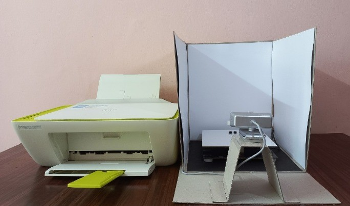
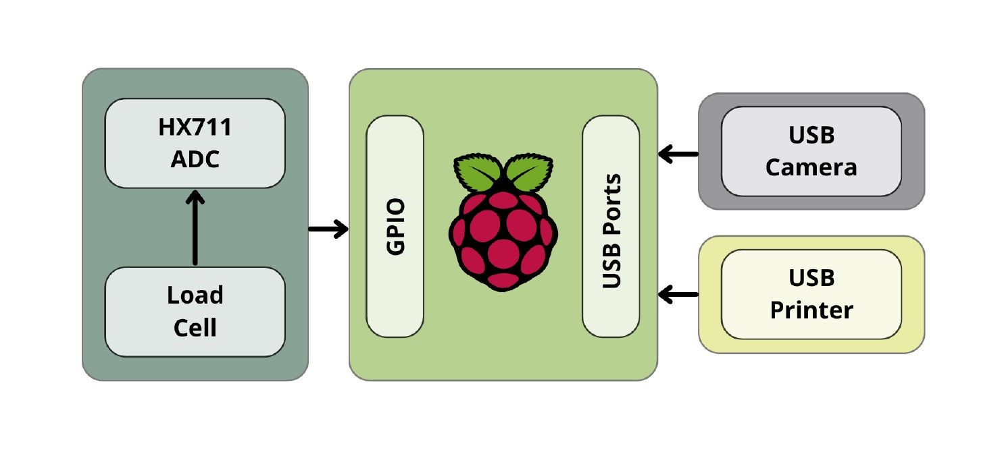
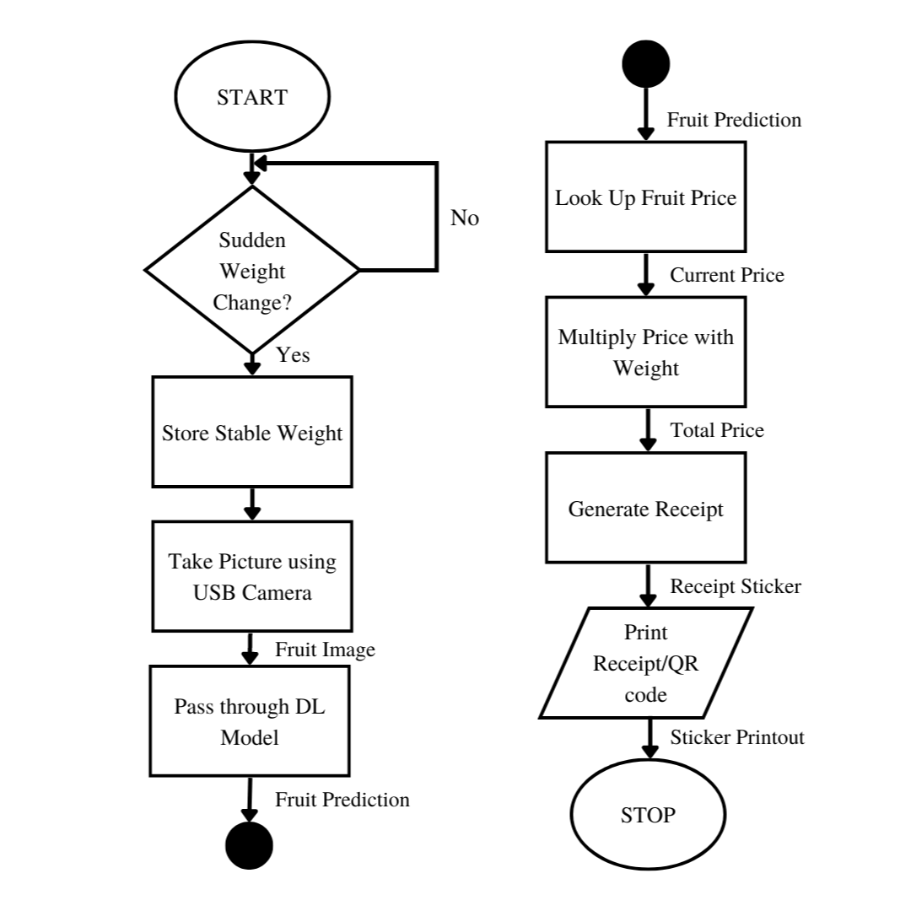
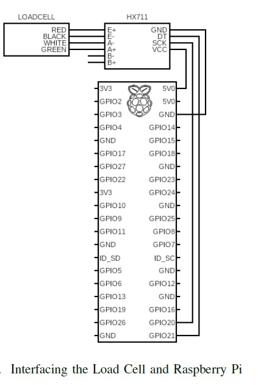

# _DeepWeight_: A Semi-Autonomous Food Weight Billing System using Deep Learning
DeepWeight is an automated food billing system that uses deep learning to detect the type of food, collect weight data using a load cell, capture an image of the food using a camera, predict the type of food in the image using a convolutional neural network (CNN) model, and print a label with relevant information using a printer. The system is designed to reduce long lines and inefficiencies in manual billing processes in grocery stores, saving time for customers and improving efficiency for store owners.

## System Architecture
The system consists of the following components:
* **Raspberry Pi 3**: The main computing unit that runs the DeepWeight software and manages all the components.
* **USB camera**: Captures the image of the food item for classification.
* **Load cell module, HX711**: Collects the weight data of the food item.
* **Printer**: Prints the label with relevant information.
* **Convolutional Neural Network (CNN) model**: Trained using the fast.ai library.

## System Workflow
The DeepWeight system follows the following workflow:
1. The customer places the food item on the load cell, triggering the weight sensing system.
2. The USB camera captures an image of the food item.
3. The captured image is fed into the CNN model for food classification.
4. The model predicts the type of food in the image.
5. The relevant information such as food name, price, and weight is printed on a label using the printer.
6. The customer can then take the labeled food item and proceed to checkout.

## Model Training
Various models were fine-tuned based on a 150 image fruit dataset containg 3 fruit classes: Apples, Bananas and Grapes. `fast.ai` was the library used to train the model, and the training and testing process is shown in the `model_training.ipynb` file.

## Installation and Usage
The DeepWeight system is designed to be easy to install and use. To use the system, follow these steps:
* Install fastbook using `pip install fastbook --no-deps`, run `main.py` and install the necessary individual libraries, as PyTorch does not work on 32-bit Raspberry Pi 3 system.
* Install the other libraries mentioned in the `requirements.txt` file.
* Connect the Raspberry Pi 3, HX711 and Load Cell as shown below:

### Connections
#### _Load Cell to HX711_
| Load Cell | HX711      |
|-----------|------------|
| E+        | Red Wire   |
| E-        | Black Wire |
| A-        | White Wire |
| A+        | Green Wire |

#### _HX711 to Raspberry Pi 3_
| HX711 | Raspberry Pi |
|-------|--------------|
| GND   | GND          |
| DT    | Pin 21       |
| SCK   | Pin 20       |
| VCC   | 5V           |

* Calibrate the load cell using [galdalf15's code to save state.](https://github.com/gandalf15/HX711/blob/master/python_examples/example_save_state.py) as a .swp file.
* Connect the USB camera and printer to the Raspberry Pi.
* Finally, run `main.py`.
